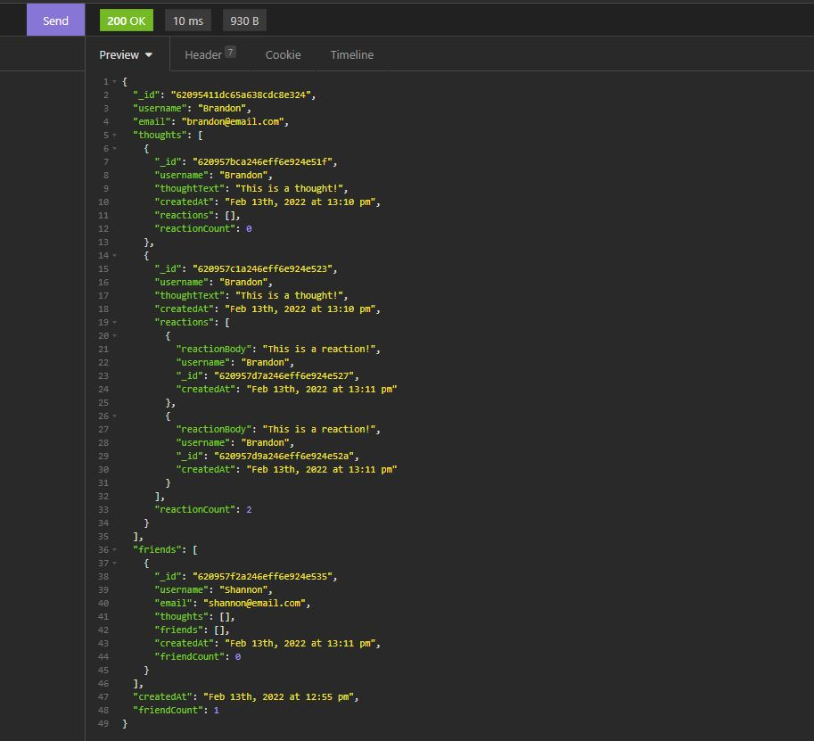

# Thoughtbook API

## Description

Thoughtbook API is a social network back-end that uses CRUD operations on a MongoDB database through the mongoose package. The API can be used to create, edit, and delete users and users' thoughts (posts), as well as create and delete users' reactions to thoughts.

## Table of Contents

- [Installation](#installation)
- [Usage](#usage)
- [License](#license)
- [Contributing](#contributing)
- [Questions](#questions)

## Installation

Download the repository with `git clone <url>`, then from the root directory install all node dependencies with `npm i`.

## Usage

Run the server with `npm run start` or `node server`. Test API route functionality with Postman, Insomnia, or similar software. Must have MongoDB installed on your machine to run the database locally. For a video demonstration of this API, visit [here](https://watch.screencastify.com/v/yUjhJd2Q4ItIK0KRmhL3).

## License

[The MIT License](https://mit-license.org/)

Copyright © 2022 branjames117

Permission is hereby granted, free of charge, to any person obtaining a copy of this software and associated documentation files (the “Software”), to deal in the Software without restriction, including without limitation the rights to use, copy, modify, merge, publish, distribute, sublicense, and/or sell copies of the Software, and to permit persons to whom the Software is furnished to do so, subject to the following conditions:

The above copyright notice and this permission notice shall be included in all copies or substantial portions of the Software.

THE SOFTWARE IS PROVIDED “AS IS”, WITHOUT WARRANTY OF ANY KIND, EXPRESS OR IMPLIED, INCLUDING BUT NOT LIMITED TO THE WARRANTIES OF MERCHANTABILITY, FITNESS FOR A PARTICULAR PURPOSE AND NONINFRINGEMENT. IN NO EVENT SHALL THE AUTHORS OR COPYRIGHT HOLDERS BE LIABLE FOR ANY CLAIM, DAMAGES OR OTHER LIABILITY, WHETHER IN AN ACTION OF CONTRACT, TORT OR OTHERWISE, ARISING FROM, OUT OF OR IN CONNECTION WITH THE SOFTWARE OR THE USE OR OTHER DEALINGS IN THE SOFTWARE.

## Contributing

This repository and its contributors follow the [Contributor Covenant Code of Conduct](https://www.contributor-covenant.org/version/2/1/code_of_conduct/code_of_conduct.md).

## Questions

This repository was created and is maintained by [branjames117](https://github.com/branjames117).

With any questions email the repository owner at [branjames117@gmail.com](mailto:branjames117@gmail.com).
